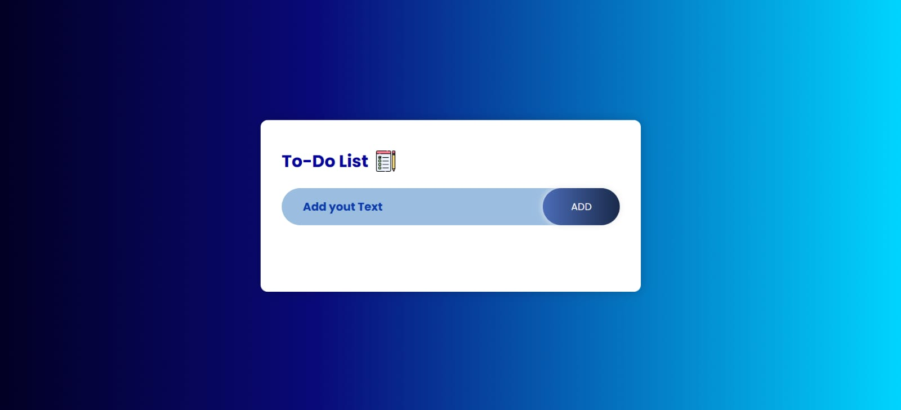

# ✅ To-Do List App

A clean, modern, and user-friendly **To-Do List** web app built with HTML, CSS, and JavaScript. This app helps users organize their tasks effectively — with the bonus of **localStorage** to save them even after refreshing!

---

## 🖼️ Preview



---

## 🔍 Features

- 📋 Add, display, and delete tasks
- 💾 Tasks are stored in `localStorage` (persistent even after page reload)
- 🎨 Sleek gradient background and rounded UI elements
- 📱 Responsive design that works on all devices

---

## 🛠️ Built With

- HTML5
- CSS3
- JavaScript
- localStorage API

---

## 💡 What I Practiced

- DOM manipulation and event handling
- `localStorage` integration
- Clean UI/UX with gradients and card-based layout
- Input validation and responsive design

---

## 🚀 How to Use
   ```bash
1. Clone the repo:
git clone https://github.com/vinaya2007/To-do-List.git


2. Navigate to the project folder:
cd To-do-List

3. Open index.html in your browser.

```

📬 Contact
📧 vinayavinodh07@gmail.com 📞 +91 90032 80933

Credits Built by Vinaya V
